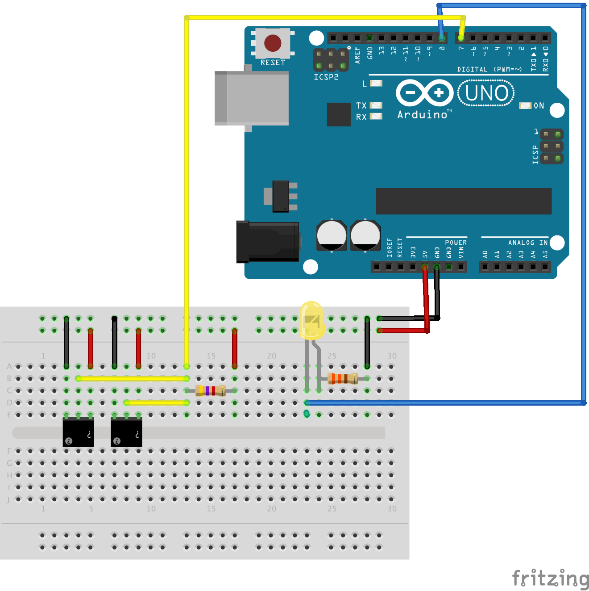

# Monitoring the temperature of the rabbit cage/hutch

## Uno + Munin

This is based around an arduino uno with two DS18B20 one wire temperature sensors for measuring and an
ethernet with poe shield (providing both network and power). It uses the arduino project Temperature and
the munin files.

## Wemos + ThingSpeak

This is based on a Wemos D1 mini, the same two DS18B20 sensors but sends the data
to a ThingSpeak channel.

## Parts

### Circuit

### Temperature

This is the arduino sketch for the project using an Uno and sending to munin.

Heavily based on [this tutorial from raywenderlich.com](http://www.raywenderlich.com/38841/arduino-tutorial-temperature-sensor),
updated based on [this wiki page](http://arduino-info.wikispaces.com/Brick-Temperature-DS18B20) for multiple devices on one bus
but returning output suitable for munin instead of JSON.

### WemosThingSpeak

This is the arduino sketch for the project using a Wemos D1 mini and sending to
ThingSpeak.

You will need to copy example_config.h into the WemosThingSpeak directory, rename
it to config.h and set your thingspeak and probe details.

### munin

Simple munin script that munin will use to poll the arduino.

### libs

Two libraries that are used in the arduino sketch. In the app - choose Sketch > Import Library > Add Library and add both zips - they should then appear under Sketch > Import Library > Contributed

The libraries are from:

* http://milesburton.com/Main_Page?title=Dallas_Temperature_Control_Library - currently using 372Beta (this is the same zip - just rezipped to remove hyphens from the folder name - which was invalid at import)
* http://www.pjrc.com/teensy/td_libs_OneWire.html - OneWire 2

### fritzing

Source file for fritzing to generate layout image.

### mccad

Source file for McCad Schematics_Lite to generate circuit image.