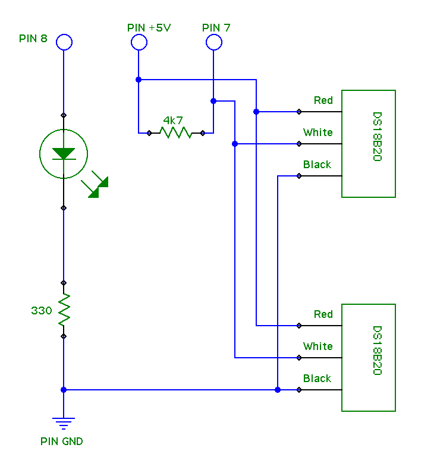

# Monitoring the temperature of the rabbit cage/hutch

This is based around an arduino uno with two DS18B20 one wire temperature sensors for measuring and an
ethernet with poe shield (providing both network and power).

## Parts

### Circuit

### Temperature

This is the arduino sketch for the project.

Heavily based on [this tutorial from raywenderlich.com](http://www.raywenderlich.com/38841/arduino-tutorial-temperature-sensor)
but returning output suitable for munin instead of JSON.

### munin

Simple munin script that munin will use to poll the arduino.

### libs

Two libraries that are used in the arduino sketch. In the app - choose Sketch > Import Library > Add Library and add both zips - they should then appear under Sketch > Import Library > Contributed

The libraries are from:

* http://milesburton.com/Main_Page?title=Dallas_Temperature_Control_Library - currently using 372Beta (this is the same zip - just rezipped to remove hyphens from the folder name - which was invalid at import)
* http://www.pjrc.com/teensy/td_libs_OneWire.html - OneWire 2
